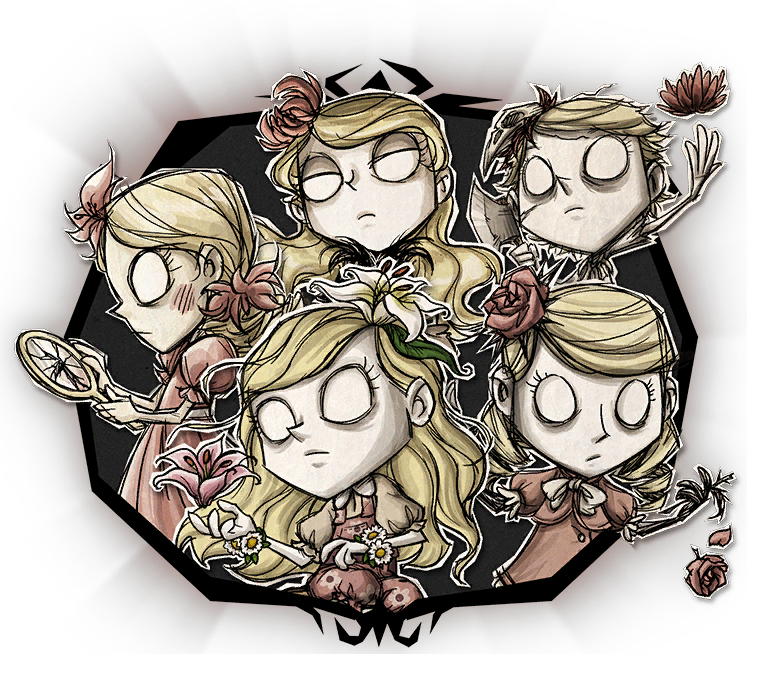

 
  
 

  

<h1>Wendy Panel</h1>

[English](./README.en.md) | **简体中文**

## 介绍

Wendy Panel是一个分布式饥荒管理面板，用于管理[饥荒联机版](https://store.steampowered.com/app/322330/_/)的专用服务器集群，基于现代化的前端项目模板[vben](https://github.com/vbenjs/vue-vben-admin)实现，其由Vue3、Vite5、ant-design-vue、Pinia、UnoCSS和Typescript等技术栈实现。通过Wendy Panel可以快速搭建饥荒服务器管理平台，并非常方便地进行维护和管理。

 

文档地址：[Docs | Wendy Panel](https://wendy.dstgo.cn/)

## 贡献

1. 从本仓库fork
2. 创建一个特色分支
3. 提交修改
4. 向本仓库提交pr
5. 等待pr被merge
